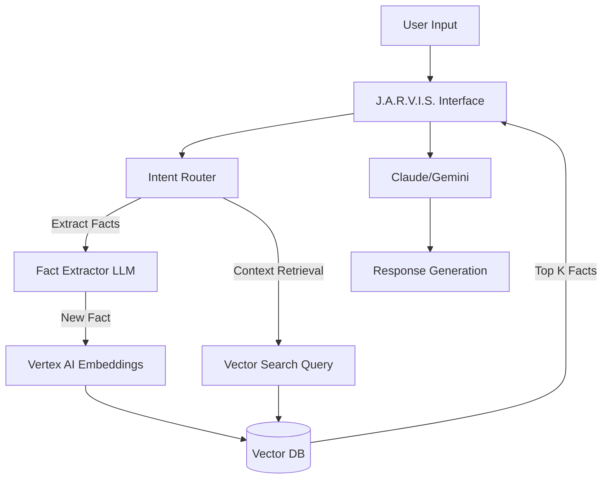

# Architecture: Memory System & Personal Knowledge Graph (PKG)

## Vision
The Personal Knowledge Graph (PKG) is the core memory engine of Odyssey.ai. It transitions J.A.R.V.I.S. from a stateless chatbot into a hyper-personalized, proactive life assistant.

Instead of relying solely on the LLM's context window (which is finite and expensive), the PKG stores, retrieves, and updates facts about the user's life, preferences, and goals using Vector Search.

## Technologies
- **Vector Database:** Google Cloud Vertex AI Vector Search (Production) / Supabase pgvector (Alternative)
- **Embeddings:** Google `text-embedding-004` (via Vertex AI)
- **Graph Structure:** Nodes (Entities) and Edges (Relationships) stored in PostgreSQL/Supabase.

## Architecture Flow

## Data Structure

### 1. `pkg_nodes` (Entities)
Stores the actual facts and entities.
- `id`: UUID
- `user_id`: UUID
- `type`: `preference`, `fact`, `goal`, `constraint`, `relationship`, `asset`
- `content`: Text description (e.g., "Allergic to peanuts", "Targeting 10k MRR")
- `embedding`: Vector representation (768 or 1536 dimensions)
- `confidence`: Float (0.0 to 1.0)
- `source`: `user_explicit`, `inferred_chat`, `imported_data`
- `created_at`, `updated_at`

### 2. `pkg_edges` (Relationships - Advanced)
Connects nodes explicitly.
- `source_node_id`
- `target_node_id`
- `relationship`: `requires`, `conflicts_with`, `supports`

## Vertex AI Integration Plan
Once Vertex AI is connected, the flow will be:
1. **Initialize Vertex AI Client:** Authenticate using Service Account.
2. **Setup Vector Search Index:** Create an active index endpoint in GCP.
3. **Fact Extraction:** On every user message, a background queue runs a lightweight prompt: *"Extract permanent facts about the user from this message."*
4. **Embedding:** The extracted facts are embedded using the Vertex AI APIs.
5. **Retrieval:** Before answering a user, JARVIS embeds the user's question, searches the Vector DB for the top 5 closest facts, and injects them into the system prompt.

## Mock Implementation (Current State)
Until Vertex AI is configured, the system uses an in-memory dictionary cache in `ai-engine.ts` representing basic contextual memory.
